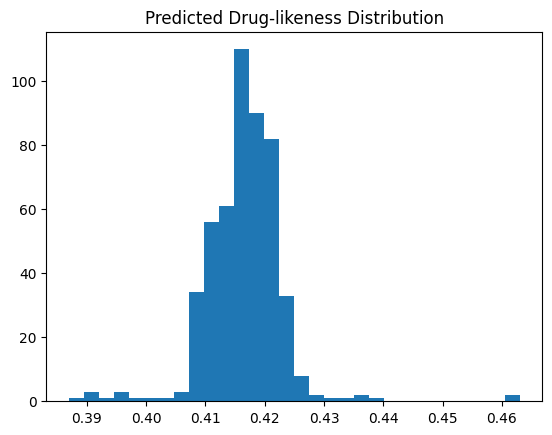

<div align="center">

# 🧪 GNN-Based Drug-Likeness Prediction (BBBP)

### A Graph Neural Network Framework for Blood-Brain Barrier Penetration Prediction

---


-2ea44f?style=flat-square)


---

### 🧠 BBB Penetration • Drug-Likeness • Molecular AI

</div>
---

## 🧠 Overview

This project implements a **Graph Neural Network (GIN)** for predicting **drug-likeness / BBB permeability** from molecular structures (SMILES).

0

---

## 🔬 Problem Statement

Predict whether a molecule can pass the Blood-Brain Barrier using only its structural information.

1

---

## 📊 Dataset

- BBBP dataset (MoleculeNet)
- ~2039 molecules
- SMILES-based molecular graphs

---

## ⚙️ Method

- Graph Isomorphism Network (GIN)
- Node-based message passing
- Global mean pooling
- Binary classification

---

## 📈 Results

- ROC-AUC: ~0.74  
- PR-AUC: ~0.89  
- MCC: ~0.44  

---

## 📊 Visualization

### 🔹 Drug-likeness Score Distribution



This plot shows how the model distributes predicted molecular probabilities.

---

## 🚀 How to Run

```bash
pip install -r requirements.txt
python src/train.py
python src/eval.py
📦 Project Structure
Copy code
Text
src/
models/
results/
paper.md
README.md
⚠️ Limitations
No scaffold split
Simple GIN architecture
No hyperparameter tuning
🧪 Conclusion
This project demonstrates an end-to-end pipeline for molecular property prediction using Graph Neural Networks for virtual screening applications.
📌 Keywords
Graph Neural Networks, Drug Discovery, BBBP, SMILES, Virtual Screening
Copy code
